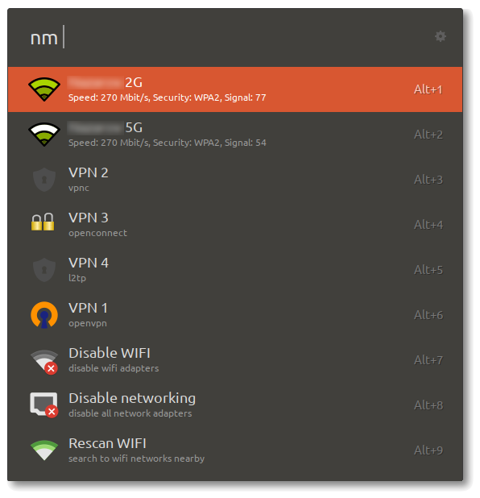
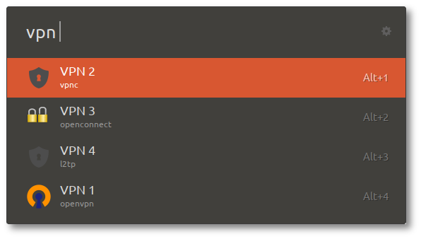

# ulauncher-nm

[Ulauncher](https://ulauncher.io) extension for interacting with [NetworkManager](https://www.freedesktop.org/wiki/NetworkManager/) profiles & settings.

## Features

- Search and activate/deactivate VPN profiles and WIFI networks
- Switch on/off network connectivity and WIFI adapters
- Several different quick access lists: VPN, WIFI, settings and main for all lists
- Profiles sorted by usage tracking
- Caching of VPN profiles details

## Configuration

- `rescan_interval`: time interval of WIFI networks rescan (in seconds)
- `rescan_wait`: how much time to wait for wifi networks rescan results (in seconds)

## Keywords

- `List all profiles`: all-in-one, list all NM profiles (VPN, WIFI) and settings
- `List VPN profiles`: list and activate/deactivate configured VPN profiles
- `List WIFI networks`: scan, list and connect/disconnect nearby WIFI networks
- `List settings`: activate/deactivate WIFI adapters, network connectivity, etc.

## Thanks

[ulauncher-remmina](https://github.com/noam09/ulauncher-remmina) for the overall extension structure.

## Screenshots

All-in-one main screen

VPN screen

